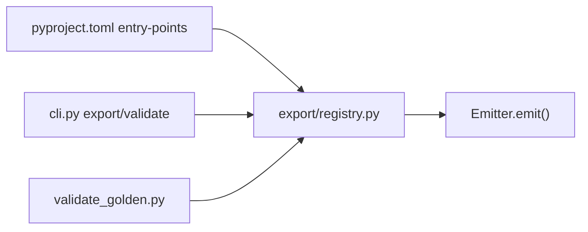

# M3.2 staff design — entry_point emitter registry

**task_id:** `260623_m32-entry-points`  
**spec:** `.praxia/docs/specs/260623_m32-buildable-spec-rev1.md`  
**backlog:** #2563

## Architecture

## Subagent routing

| Wave | Agent | Files |
|------|-------|-------|
| W1 | fixer | `registry.py`, `pyproject.toml`, `tests/test_export_registry.py` |
| W2 | fixer | `validate_golden.py` |
| W3 | fixer | `cli.py` |
| W4 | reviewer | full pytest + `test_export_regression_m32.py` |

## Worktree safety

Execute on `main` (`worktree_safe=false`). Promote #2563 before execute if backlog policy requires.

## Success metrics

- 275+ pytest green, ruff clean
- 5 golden digests bitwise unchanged
- No new public API beyond `get_emitter` / `list_emitter_surfaces`

## Adversarial verdict

**ACCEPT** — scope bounded to dispatch refactor; factory pattern preserves `emit_command_bodies`; L33 preserves CLI never-raise for `emit()` path.
