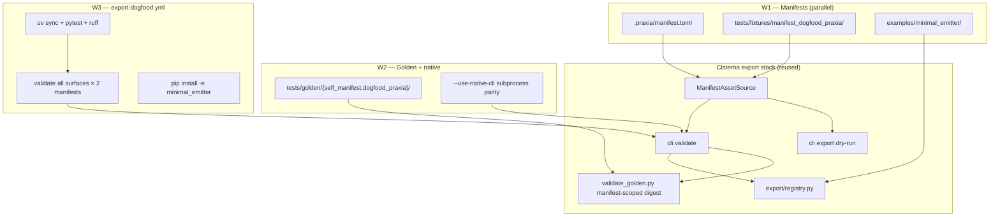
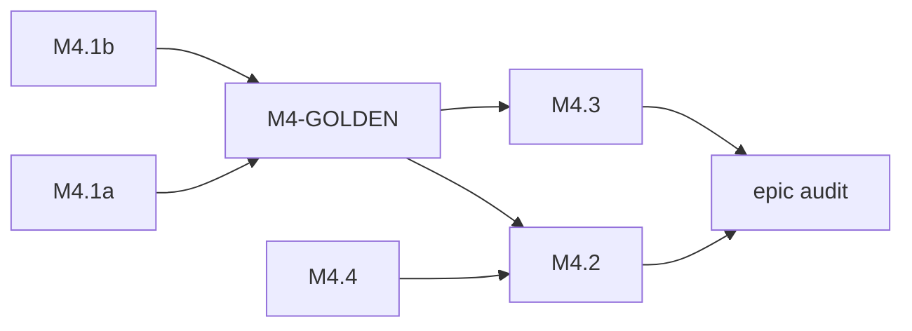

# M4 Export Trust — staff design

**task_id:** `260623_m4-export-trust`  
**spec:** `.praxia/docs/specs/260623_hmw-select-cisterna-m4-milestone-after-m.md`  
**parent:** M4 Export Trust (backlog TBD)  
**depends_on:** #2581 (M3.3)  
**baseline:** 296 tests · M3.3 complete · four `cisterna.emitters` entry points · no `.github/workflows` · no `.praxia/manifest.toml` · no `examples/`

## Summary

Ship `.praxia/manifest.toml` and a praxia-scale fixture, gate every PR with in-process validate/export across four built-in surfaces, add advisory subprocess parity tests, and document third-party `cisterna.emitters` entry points via `examples/minimal_emitter/`.

## Architecture

**Trust chain:** load (structural) → emit (deterministic) → digest (golden) → optional subprocess parity → CI gate.

## Implementation DAG

| Wave | Tasks | Gate |
|------|-------|------|
| **W1** | M4.1a ∥ M4.1b ∥ M4.4 | Disjoint asset trees + example package |
| **W2** | M4-GOLDEN → M4.3 | Manifest-scoped goldens; native unit tests (`cli.py` serial) |
| **W3** | M4.2 | CI workflow green |
| **W4** | M4 epic audit | reviewer APPROVE vs AC matrix |

## File ownership matrix

| Path | M4.1a | M4.1b | M4-GOLDEN | M4.2 | M4.3 | M4.4 |
|------|:-----:|:-----:|:---------:|:----:|:----:|:----:|
| `.praxia/**` | **O** | — | — | — | — | — |
| `tests/fixtures/manifest_dogfood_praxia/**` | — | **O** | — | — | — | — |
| `tests/golden/self_manifest/**` | — | — | **O** | — | — | — |
| `tests/golden/dogfood_praxia/**` | — | — | **O** | — | — | — |
| `tests/golden/{claude,cursor,copilot,antigravity}/` | — | — | R | — | — | — |
| `src/cisterna/assets/validate_golden.py` | — | — | **O** | — | R | — |
| `src/cisterna/cli.py` | — | — | **O** | — | **O** | — |
| `src/cisterna/assets/manifest.py` | — | — | — | — | — | — |
| `.github/workflows/export-dogfood.yml` | — | — | — | **O** | R | — |
| `tests/test_cli_native_validate.py` | — | — | — | — | **O** | — |
| `examples/minimal_emitter/**` | — | — | — | R | — | **O** |

**M3.3 lesson:** W1 tracks touch disjoint trees only; `manifest.py` frozen; `cli.py` edits serialized in W2 (golden first, native second).

## Subagent routing

| Wave | Implement | Verify |
|------|-----------|--------|
| W1 | fixer ×3 (1a, 1b, 4 parallel) | reviewer spot-check AC-M4-1 |
| W2 | fixer (golden → native) | reviewer: `test_cli_assets_validate` + `test_cli_native_validate` |
| W3 | fixer (workflow) | reviewer: first green CI |
| W4 | — | reviewer epic audit |

## Backlog children

| ID | Title | depends_on | Size |
|----|-------|------------|------|
| M4.1a | Repo self-manifest | — | L2 |
| M4.1b | Praxia-scale dogfood fixture | — | L2 |
| M4-GOLDEN | Manifest-scoped golden digests + resolver | M4.1a, M4.1b | L1 |
| M4.4 | Third-party emitter example | — | L1 |
| M4.2 | Dogfood CI workflow | M4-GOLDEN, M4.1a, M4.4 | L2 |
| M4.3 | Subprocess validate lane | M4-GOLDEN | L1 |

## M4-GOLDEN — manifest-scoped golden resolver

**Problem:** `golden_digest_path(surface, mode)` is global; self-manifest and dogfood fixture cannot pass AC-M4-2b/d without per-manifest digests.

**Change:** Extend `validate_golden.golden_digest_path` to accept optional `manifest: Path`; resolve slug from manifest location:

| Manifest | Golden root |
|----------|-------------|
| `tests/fixtures/manifest_minimal/manifest.toml` | `tests/golden/<surface>/<mode>/` (legacy, AC-M4-0b) |
| `.praxia/manifest.toml` | `tests/golden/self_manifest/<surface>/<mode>/` |
| `tests/fixtures/manifest_dogfood_praxia/manifest.toml` | `tests/golden/dogfood_praxia/<surface>/<mode>/` |

Wire `cli.validate_assets` to pass manifest path into resolver.

## Self-manifest sketch (M4.1a)

- `[plugin].name = "cisterna"` (sync version with `pyproject.toml`)
- ≥1 skill, ≥1 agent, ≥1 hook_spec, `export_command` for claude_code + cursor
- L14 `[[plugin.workflows]]` with existing file (validate-only)
- CI uses `--manifest .praxia/manifest.toml` only (no FastMCP registry dependency)

## Praxia fixture sketch (M4.1b)

`tests/fixtures/manifest_dogfood_praxia/` — vendored tree: ≥2 skills, ≥1 agent, ≥1 hook, export_command for ≥2 vendors, workflows/pipelines/snippets with real files. AC-M4-1d via `tmp_path` or `_broken` sibling with missing workflow path.

## CI workflow (M4.2)

`.github/workflows/export-dogfood.yml`:

- **Required job `dogfood`:** `uv sync`, `ruff`, full `pytest`, validate loop (4 surfaces × self + dogfood), claude `--emit-command-bodies`, dry-run export, `uv pip install -e examples/minimal_emitter` + example tests
- **Advisory job `native-validate-advisory`:** `continue-on-error: true`; claude `--use-native-cli` names_only + with_command_bodies on self-manifest

## minimal_emitter sketch (M4.4)

Standalone package under `examples/minimal_emitter/` with `[project.entry-points."cisterna.emitters"] minimal = "minimal_emitter:factory"`. `MinimalEmitter.emit()` returns `{"minimal-plugin.json": ...}`. README documents install and factory signature.

## Risks

| Risk | Mitigation |
|------|------------|
| Global goldens block multi-manifest CI | M4-GOLDEN resolver (required) |
| Self-manifest too thin | Praxia fixture + AC-M4-2d |
| Native subprocess flaky | Advisory CI + unit tests |
| `cli.py` collision | W2 serialization |
| Example pollutes dev venv | Opt-in install; CI fresh venv |

## Escalations resolved in design

| Item | Resolution |
|------|------------|
| Golden-slug extension | **Accepted** — L1 product change, documented here; preserves legacy goldens |
| TBD-1 vendor IDE validators | **Deferred** post-M4; subprocess parity only |
| Self-manifest plugin.name | **`cisterna`** (product identity) |

## Adversarial verdict

**ACCEPT_WITH_NITS** — reconciled in `.praxia/docs/specs/260623_m4-export-trust-buildable-spec-rev1.md`.

| Challenger | Defender | Synthesis |
|------------|----------|-----------|
| C1 M4-GOLDEN missing from spec | Rebut (required for AC-M4-2) | **Accepted** — added M4-GOLDEN child + resolver table in buildable spec |
| C2 `list_emitter_surfaces()` vs 4 surfaces | Concede | **Fixed** — AC-M4-2b/d hardcode built-in set; AC-M4-2g install ordering |
| C6 AC-M4-1d vs 2d same fixture | Blocking | **Fixed** — broken fixture is tmp_path or `_broken` sibling |
| C3/C4/C5/C7/C8 | Warnings | **Fixed** in rev1 spec (manifest pins, refresh AC, fail-closed unknown) |
| Vendor IDE trust gap | Concede | **Documented** TBD-1; in-scope is structural + digest trust only |

**Gate:** Proceed to backlog registration + sprint compose on PI confirm.

## Worktree safety

Execute on `main` (`worktree_safe=false`). Register parent M4 epic + children before sprint compose.

## Success metrics

- AC-M4-0 through AC-M4-4e pass
- Test count ≥ 296; ruff clean
- Legacy `tests/golden/{claude,cursor,copilot,antigravity}/` digests unchanged (AC-M4-0b)
- No new built-in emitter surfaces in core package
