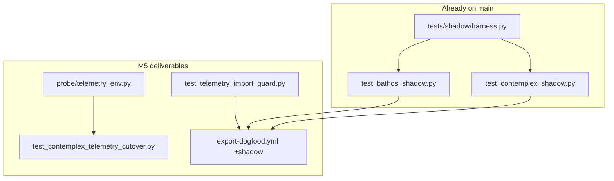

# M5 Telemetry Adoption — staff design

**task_id:** `260623_m5-telemetry-adoption`  
**spec:** `.praxia/docs/specs/260623_hmw-select-cisterna-m5-milestone-after-m.md`  
**parent:** M5 (backlog TBD) · **depends_on:** #2597  
**baseline:** 307 tests · shadow harness **already shipped** (M1 `tests/shadow/`)

## Summary

Harden telemetry adoption: wire existing shadow parity into dogfood CI, add import guard for export CI safety, ship `CISTERNA_TELEMETRY` gate + contemplex integration smoke in cisterna. Contemplex **repo** cutover is a follow-up PR (TBD-1).

## Architecture

## Discovery (recon)

| Claim | Evidence |
|-------|----------|
| Shadow harness exists | `tests/shadow/harness.py`, 4 tests green |
| No auto-init on import | `get_pipeline()` returns None until `cisterna.init()` |
| v2_decorator ready | `traced_tool` + `ContemplexAdapter` in `adapters/` |
| Contemplex repo cutover | **Out of repo** — cisterna ships gate + smoke only |

## Child work packages

| ID | Deliverable | depends_on |
|----|-------------|------------|
| **M5.0** | Import guard test | — |
| **M5.1a** | Shadow in dogfood CI + AC path aliases in spec | — |
| **M5.1b** | `telemetry_env.py` + cutover smoke test | M5.0 |
| **M5.2** | Contemplex repo integration doc/backlog stub | M5.1b |

## File ownership

| Path | M5.0 | M5.1a | M5.1b |
|------|:----:|:-----:|:-----:|
| `tests/test_telemetry_import_guard.py` | **O** | — | — |
| `.github/workflows/export-dogfood.yml` | — | **O** | — |
| `src/cisterna/probe/telemetry_env.py` | — | — | **O** |
| `tests/test_contemplex_telemetry_cutover.py` | — | — | **O** |
| `tests/shadow/**` | — | R | — |

## Implementation DAG

| Wave | Tasks |
|------|-------|
| **W1** | M5.0 ∥ M5.1a (CI shadow step) |
| **W2** | M5.1b cutover gate + smoke |
| **W3** | Epic audit |

## Risks

| Risk | Mitigation |
|------|------------|
| Shadow tests don't run in CI today | Add `pytest tests/shadow/` to export-dogfood |
| Contemplex cutover can't land in cisterna alone | M5.1b = gate + smoke; M5.2 = external backlog #TBD |
| Spec AC names mismatch (`test_bathos_parity` vs `test_bathos_shadow`) | Buildable spec cites actual paths |

## Adversarial verdict

**ACCEPT_WITH_NITS** — scope narrowed: shadow is harden+CI not greenfield; contemplex production cutover is sibling-repo follow-up.
