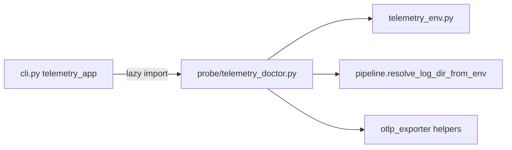

# M10.1 Telemetry doctor CLI — staff design + adversarial review

**task_id:** `260624_autonomous-loop`  
**spec:** `.praxia/docs/specs/260624_m10-1-telemetry-doctor-cli-for-cisterna.md`  
**backlog:** #2650  
**baseline:** 376 tests · M10 runbook shipped

## Summary

Add `cisterna telemetry doctor` — read-only operator diagnostic printing effective telemetry config. Implementation in dedicated module with lazy CLI wiring to preserve fastmcp-free `cisterna.cli` import.

## Architecture

## Recon

| Claim | Evidence |
|-------|----------|
| Consumer gate | `consumer_telemetry_enabled()` in `telemetry_env.py` |
| Log dir precedence | `init_pipeline` L240-248 `pipeline.py` (inline, not extracted yet) |
| OTLP helpers exist | `otlp_sdk_available()`, `resolve_otlp_protocol()`, `maybe_create_otlp_exporter()` |
| Pipeline inactive in CLI | `get_pipeline()` None until `cisterna.init()` — expected |
| fastmcp-free cli | `tests/test_cli_assets.py` AC-M3-8e |
| Runbook not in wheel | `.praxia/docs/runbooks/` is dev/operator path only |

## Child work packages

| ID | Deliverable |
|----|-------------|
| **M10.1.0** | `resolve_log_dir_from_env()` extracted from `init_pipeline` |
| **M10.1.1** | `probe/telemetry_doctor.py` report builder |
| **M10.1.2** | `cli.py` `telemetry` sub-app + `doctor` command |
| **M10.1.3** | `tests/test_cli_telemetry_doctor.py` |
| **M10.1.4** | Runbook cross-link (doctor command in verification section) |

## File ownership

| Path | Owner |
|------|-------|
| `src/cisterna/probe/telemetry_doctor.py` | **O** (new) |
| `src/cisterna/telemetry/pipeline.py` | **O** (extract helper) |
| `src/cisterna/cli.py` | **O** (sub-app wiring) |
| `tests/test_cli_telemetry_doctor.py` | **O** |
| `.praxia/docs/runbooks/cisterna-telemetry.md` | **O** (one line) |

## Adversarial verdict

**ACCEPT_WITH_NITS** — reconciled in spec rev1 below.

### Challenger → Defender → Synthesis

| ID | Challenger | Defender | Synthesis |
|----|------------|----------|-----------|
| **CH-001** | **MAJOR:** Inline log_dir logic in `init_pipeline`; doctor duplicates or diverges | Pre-mortem flagged this | **Fixed** — extract `resolve_log_dir_from_env()`; `init_pipeline` and doctor both call it |
| **CH-002** | **MAJOR:** Doctor in `cli.py` bloats fastmcp-free module | Lazy import mitigates | **Fixed** — logic in `probe/telemetry_doctor.py`; cli registers subcommand only |
| **CH-003** | **MINOR:** `get_pipeline()` always inactive in CLI — low value | Still useful when doctor run from consumer process | **Nit** — label output `inactive (expected unless cisterna.init() ran)` |
| **CH-004** | **MINOR:** AC duplicates OTLP env parsing | Helpers exist | **Fixed** — doctor uses `otlp_sdk_available()`, `resolve_otlp_protocol()`, raw endpoint env |
| **CH-005** | **MINOR:** Help cites `.praxia/...` path not in installed package | Runbook is repo operator doc | **Fixed** — help string is documentation reference; no runtime file check |
| **CH-006** | **INFO:** job_span env vars in M10 runbook but not spec | Scope creep | **Nit** — optional AC-M10.1-2b job context lines if trivial |
| **CH-007** | **INFO:** Write-probe fallback hidden from operator | init_pipeline mutates to tempdir | **Fixed** — doctor shows env-resolved dir + `writable: yes/no` probe without fallback |

## Risks

| Risk | Mitigation |
|------|------------|
| Doctor/runbook drift | Tests call same helpers as runtime |
| Heavy import in doctor | Import `pipeline`/`otlp_exporter` inside command only |
| Misleading inactive pipeline | Explicit expected-state label |

## Gate

Proceed to **`go m10.1`** on PI confirm.
