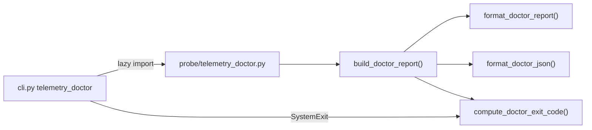

# M10.2 Telemetry doctor JSON + exit codes — staff design + adversarial review

**task_id:** `260624_autonomous-loop`  
**spec:** `.praxia/docs/specs/260624_m10-2-telemetry-doctor-json-exit-codes-e.md`  
**backlog:** #2661  
**baseline:** 386 tests · M10.1 doctor shipped

## Summary

Extend M10.1 with `build_doctor_report()` structured checks, `--json` serialization, binary exit codes (`0`/`1`), and `--strict` / `CISTERNA_DOCTOR_STRICT=1` for CI/cutover gating. Human default unchanged.

## Architecture

## Recon

| Claim | Evidence |
|-------|----------|
| M10.1 human report | `format_doctor_report()` in `telemetry_doctor.py` |
| cyclopts exit pattern | `validate` raises `SystemExit(1)`; tests use `pytest.raises(SystemExit)` |
| Consumer gate | `consumer_telemetry_enabled()` — `all`/`1`/`true`/`yes` enable all |
| OTLP helpers | `otlp_sdk_available()`, `resolve_otlp_protocol()` |
| fastmcp-free cli | `test_cli_still_fastmcp_free` |
| Deferred scope | No `--consumer` in MVP; full matrix in output |

## Child work packages

| ID | Deliverable |
|----|-------------|
| **M10.2.0** | `DoctorCheck` / `DoctorReport` dataclasses + `build_doctor_report()` |
| **M10.2.1** | Refactor `format_doctor_report()` to render from struct (parity) |
| **M10.2.2** | `format_doctor_json()`, `compute_doctor_exit_code(strict)` |
| **M10.2.3** | CLI `--json`, `--strict`; env `CISTERNA_DOCTOR_STRICT=1` |
| **M10.2.4** | Extend `tests/test_cli_telemetry_doctor.py` |
| **M10.2.5** | Runbook CI/cutover example |

## File ownership

| Path | Owner |
|------|-------|
| `src/cisterna/probe/telemetry_doctor.py` | **O** |
| `src/cisterna/cli.py` | **O** (flags + SystemExit) |
| `tests/test_cli_telemetry_doctor.py` | **O** |
| `.praxia/docs/runbooks/cisterna-telemetry.md` | **O** (example block) |

## Adversarial verdict

**ACCEPT_WITH_NITS** — reconciled in spec rev1 below.

### Challenger → Defender → Synthesis

| ID | Challenger | Defender | Synthesis |
|----|------------|----------|-----------|
| **CH-001** | **MAJOR:** `telemetry_gate` warn when "no consumer enabled" is ambiguous with per-consumer `consumers.*` rows | Aggregate gate is what scripts gate on; per-consumer rows are informational | **Fixed** — `telemetry_gate` warns only when raw unset/empty OR no known consumer is enabled (incl. invalid token). `CISTERNA_TELEMETRY=all` → pass |
| **CH-002** | **MAJOR:** Spec silent on cyclopts exit wiring | validate pattern is `raise SystemExit(code)` | **Fixed** — AC-M10.2-2b: CLI raises `SystemExit(compute_doctor_exit_code(...))` |
| **CH-003** | **MAJOR:** AC-M10.2-3 leaves `effective_status` vs `summary.strict` open | Testability needs deterministic JSON | **Fixed** — JSON includes `summary.strict: bool` + per-check `effective_status` (post-promotion); `status` unchanged |
| **CH-004** | **MINOR:** `--json` might still print human header | Operators piping JSON need clean stdout | **Fixed** — `--json` emits JSON only (no human lines) |
| **CH-005** | **MINOR:** `CISTERNA_DOCTOR_STRICT` vs `--strict` precedence undefined | Env enables CI without flag churn | **Fixed** — strict if `--strict` OR env in `1/true/yes`; flag not required when env set |
| **CH-006** | **MINOR:** OTLP endpoint unset but protocol set — no rule | Benign; protocol ignored without endpoint | **Nit** — informational `pass` check `otlp_config`; no fail |
| **CH-007** | **MINOR:** Without `--consumer`, contemplex-only enable passes strict but bathos cutover script may need bathos | MVP defers filter; scripts should set `CISTERNA_TELEMETRY` appropriately before doctor | **Nit** — runbook notes consumer env must match target repo |
| **CH-008** | **INFO:** Writable probe mutates filesystem | M10.1 accepted; mkdir+touch is diagnostic | **Accepted** — unchanged |
| **CH-009** | **INFO:** Parity test on human string fragments is brittle | Still valuable smoke test | **Nit** — prefer unit tests on `build_doctor_report()` fields; keep one parity smoke |

## Risks

| Risk | Mitigation |
|------|------------|
| CI forgets `--strict` | Runbook example + `summary.strict` in JSON for audit |
| JSON/human drift | Single `build_doctor_report()` source |
| Invalid `CISTERNA_TELEMETRY` token passes default | `telemetry_gate` fails warn when zero consumers enabled |

## Gate

Proceed to **`go m10.2`** on PI confirm.
