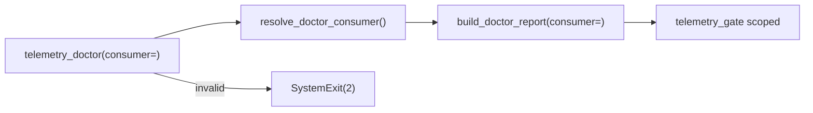

# M10.4 Doctor --consumer filter — staff design + adversarial review

**task_id:** `260624_autonomous-loop`  
**spec:** `.praxia/docs/specs/260624_m10-4-doctor-consumer-filter-add-optiona.md`  
**backlog:** #2664  
**baseline:** 401 tests  
**adversarial:** `.praxia/docs/research/260624_m10-4-adversarial-review.md`

## Summary

Add optional `--consumer` / `CISTERNA_DOCTOR_CONSUMER` to scope `telemetry_gate` to one target consumer. Invalid name → exit 2 before report (usage error).

## Architecture

## Child work packages

| ID | Deliverable |
|----|-------------|
| **M10.4.1** | `resolve_doctor_consumer()` + `DoctorReport.consumer_filter` |
| **M10.4.2** | Scoped `telemetry_gate` in `build_doctor_report()` |
| **M10.4.3** | CLI `--consumer`; exit 2 on `ValueError` |
| **M10.4.4** | JSON `summary.consumer_filter`; human target line |
| **M10.4.5** | Tests + runbook cutover example |

## Adversarial verdict

**ACCEPT_WITH_NITS** — reconciled in spec rev1.

| ID | Challenger | Defender | Synthesis |
|----|------------|----------|-----------|
| **CH-001** | **MAJOR:** Wrong-repo `--consumer` confuses | Pre-mortem | **Fixed** — gate message raw + target |
| **CH-002** | **MAJOR:** Missing report field | JSON drift | **Fixed** — `DoctorReport.consumer_filter` |
| **CH-003** | **MINOR:** Case on flag | `consumer_telemetry_enabled` already lowercases | **Fixed** — canonical lowercase |
| **CH-004** | **MINOR:** Empty flag/env | Ambiguous | **Fixed** — treat as no filter |
| **CH-005** | **MINOR:** --json + invalid | Mixed output | **Fixed** — fail before JSON |

## Gate

Proceed to **`go m10.4`**.
