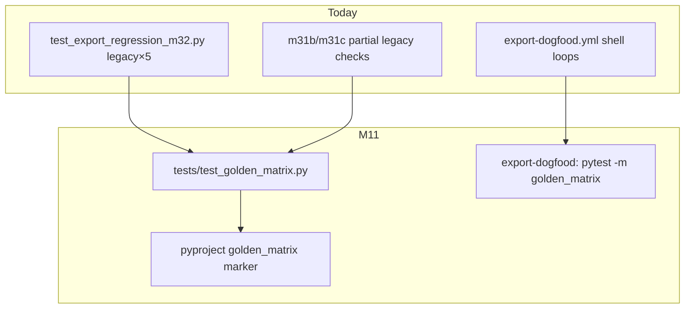

# M11 Export hardening II — staff design + adversarial review

**task_id:** `260624_autonomous-loop`  
**spec:** `.praxia/docs/specs/260624_m11-export-hardening-ii-for-cisterna-exp.md`  
**backlog:** #2649  
**baseline:** ~359 tests · 15 golden digest files on disk · export-dogfood shell validate loops (M4.2)

## Summary

Ship a parameterized pytest golden matrix (`@pytest.mark.golden_matrix`) covering **15 tuples** (3 manifest slugs × 4 surfaces × claude dual-mode), register the marker, fill CI gap for legacy manifest, and replace redundant shell `cisterna assets validate` loops with the matrix step — while preserving M4.2 integration ordering and structural load semantics.

## Architecture

## Recon (pre-adversarial)

| Claim | Evidence |
|-------|----------|
| 15 golden files exist | `tests/golden/**` — incl. `dogfood_praxia/claude/with_command_bodies` |
| Shell CI skips legacy | `export-dogfood.yml` validates self + dogfood only |
| M32 covers legacy only | `test_export_regression_m32.py` — 5 tuples, `ManifestAssetSource` |
| CLI uses composite load | `cli.validate_assets` → `load_asset_report` → `CompositeAssetSource` |
| Manifest ≡ composite today | Verified for all three manifests (no registry cmd delta) |

## Child work packages

| ID | Deliverable | depends_on |
|----|-------------|------------|
| **M11.0** | `golden_matrix` pytest marker in `pyproject.toml` | — |
| **M11.1** | `GOLDEN_MATRIX_CASES` + parameterized test | M11.0 |
| **M11.2** | Verify 15 on-disk goldens; refresh dogfood claude bodies if drift | M11.1 |
| **M11.3** | export-dogfood: matrix step before minimal_emitter; remove shell loops | M11.1 |
| **M11.4** | Consolidate M32 legacy loop into matrix; slim M32 to registry-only assertion | M11.1 |
| **M11.5** | Golden refresh docstring + AC-M11-6 | M11.1 |

## File ownership

| Path | Owner |
|------|-------|
| `tests/test_golden_matrix.py` | **O** (new) |
| `pyproject.toml` `[tool.pytest.ini_options.markers]` | **O** |
| `.github/workflows/export-dogfood.yml` | **O** |
| `tests/test_export_regression_m32.py` | **O** (dedupe) |
| `src/cisterna/assets/validate_golden.py` | R |

## Adversarial verdict

**ACCEPT_WITH_NITS** — reconciled in spec (rev1 AC amendments below). No blockers; implement after reconciliation.

### Challenger → Defender → Synthesis

| ID | Challenger | Defender | Synthesis |
|----|------------|----------|-----------|
| **CH-001** | **MAJOR:** AC-M11-1 uses bare `ManifestAssetSource`; CLI validate uses `load_asset_report` / composite merge — matrix could diverge if registry commands appear. | Today manifest≡composite for all three manifests; M32 already uses manifest-only. | **Fixed** — AC-M11-1 requires `load_asset_report(manifest=path).bundle` for parity with CLI. |
| **CH-002** | **MAJOR:** Removing shell validate drops conflict/warning exit-1 checks (M4 validate path). | Matrix is digest-only; structural checks live in `test_self_manifest.py`, `test_dogfood_praxia_fixture.py`. | **Fixed** — AC-M11-1b: matrix test asserts `report.conflicts == ()` and `report.warnings == ()` before digest compare. |
| **CH-003** | **MINOR:** `golden_matrix` marker not registered — `-m golden_matrix` warns/fails strict config. | Obvious implementation step. | **Fixed** — AC-M11-0b. |
| **CH-004** | **MINOR:** AC-M11-2 says "add missing dogfood claude bodies" but file already on disk. | Brainstorm stale; still need verify-on-run. | **Fixed** — AC-M11-2 reworded to verify/regenerate if drift. |
| **CH-005** | **MINOR:** `test_export_regression_m32` duplicates legacy 5-tuple loop — dual maintenance. | M32 has AC-M32-7 historical value. | **Fixed** — AC-M11-8: M32 slimmed to single registry-dispatch smoke; matrix owns all 15 tuples. |
| **CH-006** | **MINOR:** AC-M4-2g ordering — matrix must run before `minimal_emitter` install. | AC-M11-5 mentions retain steps but not order. | **Fixed** — AC-M11-4b explicit step order. |
| **CH-007** | **INFO:** Separate `-m golden_matrix` redundant with full `pytest -q` if unmarked. | Explicit gate documents export-trust slice for operators. | **Accepted** — keep explicit CI step; marker required on matrix tests only. |
| **CH-008** | **INFO:** No test count floor AC. | Baseline ~359. | **Nit** — AC-M11-9: net test count ≥ baseline (no deletion without replacement). |

## Risks

| Risk | Mitigation |
|------|------------|
| `.praxia/manifest.toml` churn breaks matrix | AC-M11-6 refresh doc; PR template note |
| Engineers skip/xfail tuples | AC-M11-7 |
| Registry merge changes digest | AC-M11-1 `load_asset_report` |

## Gate

Proceed to sprint compose / **`go m11`** on PI confirm.
