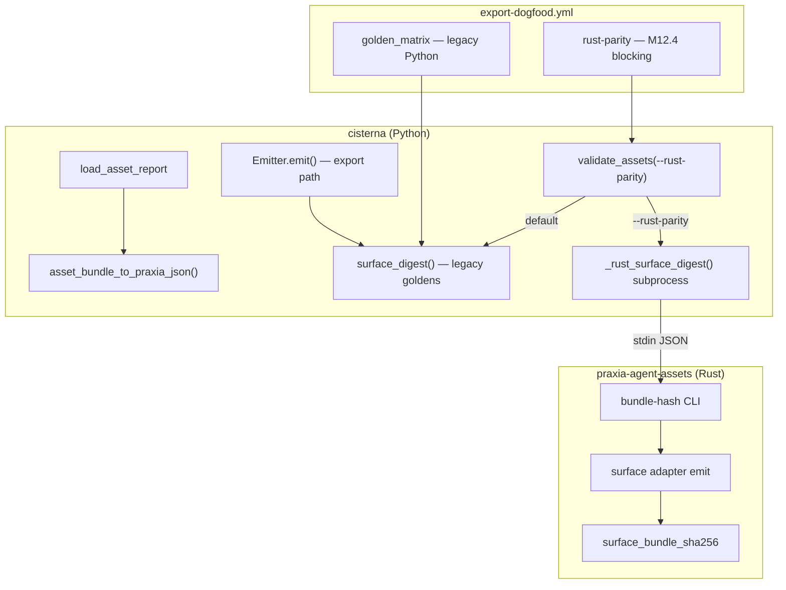

# M12 Export Rust bridge — staff design

**task_id:** `260624_autonomous-loop`  
**spec:** `.praxia/docs/specs/260624_m12-export-rust-bridge-buildable-spec-rev1.md`  
**spike:** `.praxia/docs/research/260624_m12-hash-parity-spike.md`  
**backlog:** #2665  
**baseline:** 413 passed, 2 skipped · 15 Python golden digests · export-dogfood blocking

## Summary

Close the export-trust gap between cisterna (Python emit + `bundle_sha256`) and praxia-agent-assets (Rust emit + `surface_bundle_sha256`) via a **phased subprocess bridge**: shared conformance fixtures, `bundle-hash` CLI in praxia, `cisterna assets validate --rust-parity` advisory CI, then **claude-first** emitter byte-alignment and golden migration per surface.

## Requirement (restated)

Operators and CI must be able to prove cisterna export digests match praxia-agent-assets on shared fixtures; Python goldens migrate to Rust canonical hash only after per-surface emitter bytes align.

## Architecture



### Hash canonicalization (target state)

| Layer | Today (cisterna) | Target (Rust parity) |
|-------|------------------|----------------------|
| Separator | `path\ncontents\n` | `path\0contents\n` |
| Order | `sorted(files.items())` | BTree / sorted paths |
| Scope | excludes `cisterna-provenance.json` | excludes provenance sidecar (N/A in Rust) |

Python `bundle_sha256` switches to Rust algorithm **per surface** only after emitter bytes match on conformance fixtures.

### Golden strategy (dual-track transition)

| Mode | Path | Used by |
|------|------|---------|
| **legacy_python** | `tests/golden/{slug}/{surface}/{mode}/digest.sha256` | `golden_matrix`, default `validate` |
| **rust_parity** | `tests/golden/rust_parity/{slug}/{surface}/digest.sha256` | `validate --rust-parity`, `rust-parity` CI job |

Claude `names_only` legacy tuple remains until M12.2 emitter port; rust_parity uses full 4-file Rust shape (no separate `with_command_bodies` for claude in rust lane).

## Recon anchors

| Claim | Evidence |
|-------|----------|
| Zero digest match on manifest_minimal | Spike 2026-06-24 — all 4 surfaces |
| Hash algo differs even on identical bytes | Spike: `f6a1f7c3…` vs `36334668…` on same Rust file set |
| Claude largest emit gap | Python 1 file vs Rust 4 files |
| Rust reference | `praxia/crates/praxia-agent-assets/src/bundle.rs:surface_bundle_sha256` |
| CLI validate entry | `cli.validate_assets` → `surface_digest` / golden path |
| fastmcp-free CLI | subprocess only; no PyO3 in cisterna wheel |

## Child work packages

| ID | Repo | Deliverable | depends_on | Size |
|----|------|-------------|------------|------|
| **M12.1a** | praxia | `bundle-hash` bin: `--surface`, stdin/file `PraxiaBundle` JSON → hex stdout | — | L2 |
| **M12.1b** | cisterna | `tests/conformance/` shared `PraxiaBundle` JSON + expected digests (manifest_minimal) | M12.1a | L1 |
| **M12.1c** | cisterna | `asset_bundle_to_praxia_json()` in `assets/bridge.py` | — | L2 |
| **M12.1d** | cisterna | `_rust_surface_digest()` subprocess wrapper + env `CISTERNA_PRAXIA_ASSETS_BIN` | M12.1a, M12.1c | L1 |
| **M12.1e** | cisterna | `validate --rust-parity` flag; compares subprocess digest (no golden file required for pass — compares live Rust) | M12.1d | L1 |
| **M12.1f** | cisterna | `tests/test_rust_parity.py` — manifest_minimal × 4 surfaces vs pinned expected digests | M12.1b | L1 |
| **M12.1g** | cisterna | `export-dogfood.yml` job `rust-parity` (blocking since M12.4; was `rust-parity-advisory` in M12.1): checkout praxia @ pin, `cargo build -p praxia-agent-assets --bin bundle-hash`, run parity tests | M12.1f | L2 |
| **M12.2a** | cisterna | ClaudeEmitter byte-align: 4 files, compact JSON, hooks with Praxia env wrapper | M12.1 | L3 |
| **M12.2b** | cisterna | `bundle_sha256_rust()` + switch claude `surface_digest` when `RUST_PARITY=1` or per-surface flag | M12.2a | L1 |
| **M12.2c** | cisterna | Refresh claude `rust_parity` goldens; legacy goldens unchanged until flip | M12.2b | L1 |
| **M12.3** | cisterna | cursor / copilot / antigravity emitter port + rust_parity goldens | M12.2 | L3×3 |
| **M12.4** | cisterna | Promote `rust-parity-advisory` → blocking `rust-parity` (shipped `5e05e87`); optional flip default validate deferred | M12.3 | L1 |

### Parallelism

- **Wave 1 (parallel):** M12.1a (praxia) ∥ M12.1c (cisterna mapper)
- **Wave 2:** M12.1b,d,e,f after bundle-hash exists
- **Wave 3:** M12.1g CI
- **Wave 4+:** M12.2 claude wedge, then M12.3 surfaces sequentially (merge conflict risk on emitters)

## File ownership

| Path | Owner | Action |
|------|-------|--------|
| `praxia/.../src/bin/bundle_hash.rs` | praxia | **O** new |
| `src/cisterna/assets/bridge.py` | cisterna | **O** new |
| `src/cisterna/cli.py` | cisterna | **O** `--rust-parity` |
| `src/cisterna/export/_hash.py` | cisterna | **O** `bundle_sha256_rust()` |
| `src/cisterna/export/claude.py` | cisterna | **O** M12.2 |
| `tests/conformance/` | cisterna | **O** new |
| `tests/test_rust_parity.py` | cisterna | **O** new |
| `.github/workflows/export-dogfood.yml` | cisterna | **O** advisory job |
| `tests/golden/rust_parity/` | cisterna | **O** new tree |
| `tests/test_golden_matrix.py` | cisterna | R — unchanged in M12.1 |

## `bundle-hash` CLI contract

```
bundle-hash --surface <claude|cursor|copilot|antigravity> [--bundle PATH]
```

- Input: `PraxiaBundle` JSON (stdin if `--bundle` omitted)
- Output: lowercase hex SHA-256 + newline (stdout only)
- Errors: exit 2 unknown surface; exit 1 emit/parse failure (stderr message)
- Implementation: `surface_bundle_sha256(surface, &bundle)` — provenance N/A

## `asset_bundle_to_praxia_json` mapping

| AssetBundle | PraxiaBundle |
|-------------|--------------|
| `metadata.*` | `metadata.*` |
| `commands[]` | `commands[]` (`name`, `body`) |
| `agents[]` | `agents[]` (`name`, `description`, `tools`, `body`) |
| `skills[]` | `skills[]` (`name`, `description` default `""`, `body`) |
| `hook_specs[]` | `hook_specs[]` (`event`, `matcher`, `script`, `tier`, `surfaces`) |
| `mcp_servers[]` | `mcp_servers[]` |
| — | `workflows: []`, `pipelines: []` |

Round-trip tests on `manifest_minimal` loaded bundle vs hand-built JSON from spike.

## CI pin

- Env: `CISTERNA_PRAXIA_ASSETS_REV` (git SHA) in `rust-parity-advisory` job
- Checkout: `actions/checkout@v4` on praxia repo path `../praxia` or second checkout step
- Cache: `~/.cargo/registry`, `target/` keyed by rev
- Build: `cargo build --release -p praxia-agent-assets --bin bundle-hash`
- Export: `CISTERNA_PRAXIA_ASSETS_BIN=$PWD/../praxia/target/release/bundle-hash`

## Risks

| Risk | Mitigation |
|------|------------|
| Cross-repo CI flake | Pin SHA; cache cargo; advisory before blocking |
| B1 names-only semantic break | Dual golden trees; document in runbook |
| Mapper drift (Python load ≠ Rust struct) | Conformance JSON owned jointly; round-trip test |
| praxia emitter changes without cisterna follow-up | rust-parity job fails on pin bump until cisterna catches up |
| Claude provenance sidecar | Excluded from rust parity scope (export-only) |

## Escalations

| Question | Route |
|----------|-------|
| praxia `bundle-hash` API shape | praxia maintainer / same PI |
| Flip default validate to rust | oracle after M12.3 green |

## Gate

Proceed to adversarial review → spec rev1 → **M12.1 sprint** (subprocess + fixtures only; no emitter port in first slice).

## Adversarial verdict

**ACCEPT_WITH_NITS** — reconciled in `.praxia/docs/specs/260624_m12-export-rust-bridge-buildable-spec-rev1.md`.

| ID | Challenger | Synthesis |
|----|------------|-----------|
| **CH-001** | Cross-repo praxia blocker | AC-M12-0 pin + parallel dev |
| **CH-002** | Mapper field defaults | AC-M12-1c round-trip |
| **CH-003** | Live vs pinned golden | AC-M12-1f + AC-M12-1i |
| **CH-004** | Fork CI checkout | advisory + continue-on-error |
| **CH-005** | False confidence while red | job naming + docs AC-M12-1m |
| **CH-007** | Missing bin behavior | fail closed AC-M12-1g |

Full matrix: `.praxia/docs/research/260624_m12-adversarial-review.md`

## Gate (post-adversarial)

Proceed to **M12.1 sprint compose** / `go m12.1` on PI confirm (praxia `bundle-hash` lane).
