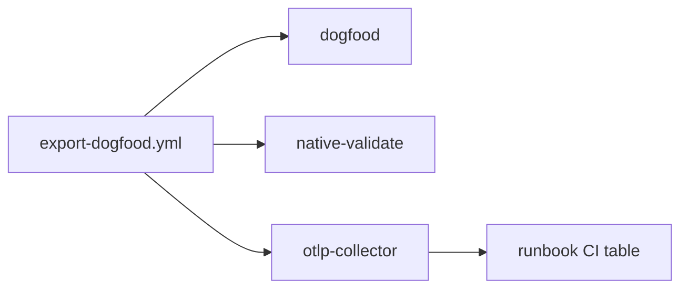

# M7.2 OTLP collector CI promotion — staff design + adversarial review

**task_id:** `260624_autonomous-loop`  
**spec:** `.praxia/docs/specs/260624_m7-2-otlp-collector-ci-promotion-promote.md`  
**backlog:** #2658  
**precedent:** M11.1 native-validate promotion  
**baseline:** 399 tests  
**adversarial:** `.praxia/docs/research/260624_m7-2-adversarial-review.md`

## Summary

Flip `otlp-collector-advisory` → required `otlp-collector` by removing `continue-on-error`. Harden ready loop to probe both OTLP ports before integration pytest.

## Architecture

## Recon

| Claim | Evidence |
|-------|----------|
| Advisory job exists | `export-dogfood.yml` L50-80 |
| Integration tests | `tests/test_otlp_http.py` `@pytest.mark.integration` |
| OTLP SDK in CI | `pyproject.toml` dev dependency group |
| M11.1 pattern | Removed `continue-on-error`, renamed job |
| Ready loop gap | Currently checks 4317 only; HTTP uses 4318 |

## Child work packages

| ID | Deliverable |
|----|-------------|
| **M7.2.1** | Workflow: rename job, remove continue-on-error, dual-port ready loop |
| **M7.2.2** | Runbook: OTLP smoke paragraph + Related CI jobs table |
| **M7.2.3** | Epic audit: grep no continue-on-error on otlp-collector |

## Adversarial verdict

**ACCEPT_WITH_NITS** — reconciled in spec rev1.

| ID | Challenger | Defender | Synthesis |
|----|------------|----------|-----------|
| **CH-001** | **MAJOR:** Ready loop gRPC-only; HTTP test may skip | Both listeners start together but race possible | **Fixed** — dual-port ready loop (AC-M7.2-2b) |
| **CH-002** | **MAJOR:** Skipped integration tests pass required job | Docker step fails if ports down | **Mitigated** + M7.2-F deferred |
| **CH-003** | **MINOR:** Docker Hub flake | Pinned image | **Accepted** |
| **CH-004** | **MINOR:** Runbook advisory references | Two sections | **Fixed** — AC-M7.2-5 |
| **CH-005** | **INFO:** No YAML unit test | M11.1 audit-only grep | **Nit** |

## Gate

Proceed to **`go m7.2`** on PI confirm.
